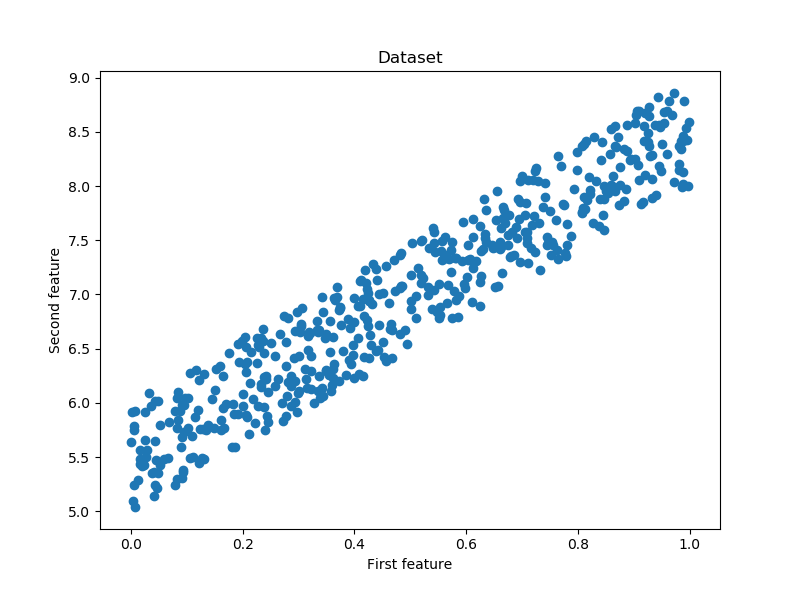
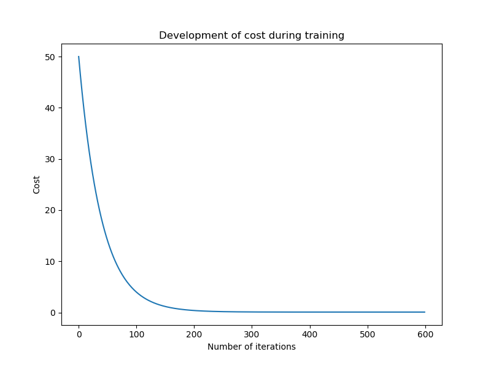
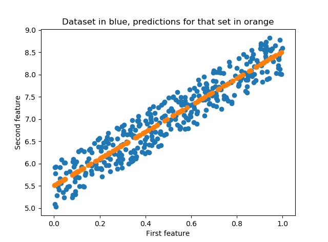

# **线性回归**

在线性回归模型中，模型是根据一个**标量因变量$y$** 和一个或者多个**预测自变量$x$** 来确定的。

**给出一些符号:**

* 数据集$\{(\bold{x}^{(1)}, y^{(1)}), ..., (\bold{x}^{(m)}, y^{(m)})\}$
* 由$\boldsymbol{x}^{(i)}$构成的特征向量$d:$ $\bold{x}^i = (x^{(i)}_1, ..., x^{(i)}_d)$
${y}^{(i)}$是目标数值变量

线性回归模型可以理解为一个非常简单的**神经网络模型：**

* 有一个实值权向量$\bold w = ({w}^{1},...,{w}^{d})$
* 有一个实值偏差$\bold b$ 
* 使用恒等函数作为它的激活函数

线性回归模型可以使用下面的两种方法进行训练
1. 梯度下降法
2. 法方程式解法（有封闭解得）: $\bold {w={({X}^{T}X)}^{-1}{X}^{T}y}$

其中$\boldsymbol{X}$是一个$(m, n_{features})$的矩阵，它包含所有的训练样例。

法方程需要计算$\bold {{X}^T{X}}$。这个运算的计算复杂度是$\bold {O(n_{features}^{2.4})}$和美元$\bold {O(n_{features}^{3})}$(取决于实现)。因此，如果训练集中的特征个数较大，法方程就会变得非常缓慢。
***
线性回归模型的训练过程有不同的步骤。第一步（**Step 0**）模型参数被初始化.其他步骤(请参见下面)在指定的迭代次数下训练或者直到参数收敛。

#### Step 0:
将权重向量和偏差初始化为0或者(小的随机值)
#### OR
使用法方程直接计算参数
***
#### Step 1:(只在梯度下降法中需要)
计算输入特征和权重的线性组合。对于所有的训练样例， 可以使用矢量化和广播一步完成：$\bold{\hat{y}={X}·{w} + b}$  
其中$\bold X$ 是一个$(m, n_{features})$的矩阵，它包含所有的训练样例，$\cdot$表示点积。
***
#### Step 2：(只在梯度下降法中需要)
使用训练集数据计算成本函数(成本函数是均方误差函数):  

$\bold{J(w,b)=\frac{1}{m}\sum_{m}^{i=1}(\hat{y}^{(i)}-y^{(i)})^2}$
***
#### Step 3(只在梯度下降法中需要):
计算成本函数对各个参数的偏导数：

$\bold{\frac{\partial J}{\partial w_j} = \frac{2}{m}\sum_{i=1}^m \Big( \hat{y}^{(i)} - y^{(i)} \Big) x^{(i)}_j}$  

$\bold{\frac{\partial J}{\partial b} = \frac{2}{m}\sum_{i=1}^m \Big( \hat{y}^{(i)} - y^{(i)} \Big)}$

包含所有参数的梯度可以通过下面的公式计算：

$\nabla_{\boldsymbol{w}} J = \frac{2}{m} \boldsymbol{X}^T \cdot \big(\boldsymbol{\hat{y}} - \boldsymbol{y} \big)$

$\nabla_{\boldsymbol{b}} J = \frac{2}{m} \big(\boldsymbol{\hat{y}} - \boldsymbol{y} \big)$
***
#### Step 4：(只在梯度下降法中需要)
更新权重向量和偏差值:

$\boldsymbol{w} = \boldsymbol{w} - \eta \, \nabla_w J$

$b = b - \eta \, \nabla_b J$

其中$\eta$为学习速率

    import numpy as np
    import matplotlib.pyplot as plt
    from sklearn.model_selection import train_test_split

    np.random.seed(123)

# Dataset
    # 使用一个简单的训练集
    X = np.random.rand(500,1)
    y = 5 + 3 * X + np.random.rand(500, 1)

    fig = plt.figure(figsize=(8,6))
    plt.scatter(X,y)
    plt.title("Dataset")
    plt.xlabel("First feature")
    plt.ylabel("Second feature")
    plt.show()

    # 将数据分割为训练集合测试集
    X_train, X_test, y_train, y_test = train_test_split(X, y)

    print(f'Shape X_train: {X_train.shape}')
    print(f'Shape y_train: {y_train.shape}')
    print(f'Shape X_test: {X_test.shape}')
    print(f'Shape y_test: {y_test.shape}')
Shape X_train: (375, 1)  
Shape y_train: (375, 1)  
Shape X_test: (125, 1)  
Shape y_test: (125, 1)  

# 线性回归类
    # 线性回归
    class LinearRegression:

        def __init__(self):
            pass

        def train_gradient_descent(self, X, y, learning_rate=0.01, n_iter=100):
            """
            使用梯度下降法训练线性回归模型
            :param X: 输入特征向量
            :param y: 目标值
            :param learning_rate:学习速率
            :param n_iter:训练迭代次数
            :return:返回权重，偏差和损失函数
            """
            # Step 0：初始化参数
            n_samples, n_features = X.shape
            self.weights = np.zeros(shape=(n_features,1))
            self.bias = 0
            costs = []

            for i in range(n_iter):
                # Step 1: 计算输入特征和权重的线性组合
                y_predict = np.dot(X, self.weights) + self.bias

                # Step 2: 通过训练集计算损失函数
                cost = (1 / n_samples) * np.sum((y_predict - y)**2)
                costs.append(cost)

                if i % 100 == 0:
                    print(f"Cost at iteration {i}: {cost}")

                # Step 3: 计算梯度
                dJ_dw = (2 / n_samples) * np.dot(X.T, (y_predict - y))
                dJ_db = (2 / n_samples) * np.sum((y_predict - y))

                # Step 4: 更新参数
                self.weights = self.weights - learning_rate * dJ_dw
                self.bias = self.bias - learning_rate * dJ_db

            return self.weights, self.bias, costs

        def train_normal_equation(self, X, y):
            """
            使用法方程训练线性回归模型
            """
            self.weights = np.dot(np.dot(np.linalg.inv(np.dot(X.T, X)), X.T), y)
            self.bias = 0

            return self.weights, self.bias

        def predict(self, X):
            return np.dot(X, self.weights) + self.bias

# 使用梯度下降法训练
    regressior = LinearRegression()
    w_trained, b_trained, costs = regressior.train_gradient_descent(X_train, y_train, learning_rate=0.005, n_iter=600)

    plt.plot(np.arange(600), costs)
    plt.title("Development of cost during training")
    plt.xlabel("Number of iterations")
    plt.ylabel("Cost")
    plt.show()

Cost at iteration 0: 66.45256981003433  
Cost at iteration 100: 2.2084346146095934  
Cost at iteration 200: 1.2797812854182806  
Cost at iteration 300: 1.2042189195356685  
Cost at iteration 400: 1.1564867816573  
Cost at iteration 500: 1.121391041394467  

#测试数据进行测试(梯度下降法)

    n_samples, _ = X_train.shape
    n_samples_test, _ = X_test.shape

    y_p_train = regressior.predict(X_train)
    y_p_test = regressior.predict(X_test)

    error_train = (1 / n_samples) * np.sum((y_p_train - y_train) ** 2)
    error_test = (1 / n_samples_test) * np.sum((y_p_test - y_test) ** 2)

    print(f"Error on training set: {np.round(error_train, 4)}")
    print(f"Error on test set: {np.round(error_test)}")
Error on training set: 1.0955  
Error on test set: 1.0

# 使用法方程进行训练
    # 为了使用法方程计算参数，我们在每个输入实例中加入一个1的偏差值
    X_b_train = np.c_[np.ones((n_samples)), X_train]
    X_b_test = np.c_[np.ones((n_samples_test)), X_test]

    reg_normal = LinearRegression()
    w_trained = reg_normal.train_normal_equation(X_b_train, y_train)

# 测试(法方程)
    y_p_train = reg_normal.predict(X_b_train)
    y_p_test = reg_normal.predict(X_b_test)

    error_train = (1 / n_samples) * np.sum((y_p_train - y_train) ** 2)
    error_test = (1 / n_samples_test) * np.sum((y_p_test - y_test) ** 2)

    print(f"Error on training set: {np.round(error_train, 4)}")
    print(f"Error on test set: {np.round(error_test, 4)}")
Error on training set: 1.0228  
Error on test set: 1.0432

# 可视化测试预测的结果
    plt.title('Dataset in blue, predictions for that set in orange')
    plt.scatter(X_train, y_train)
    plt.scatter(X_test, y_p_test)
    plt.xlabel("First feature")
    plt.ylabel("Second feature")
    plt.show()

